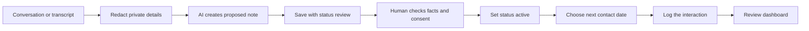

# AI Contact Demo

## Example

> Met Alex at a creative meetup. Alex runs a small video studio and wants to improve the studio website this autumn. We exchanged email addresses. No follow-up date was agreed.

AI should propose a record with `status: "review"`, `profile_complete: false`, a warm collaborator relationship, and no invented date. Confirm the full name, email, and meeting date before changing the record to `active`.

The AI proposes structure; it does not decide what belongs in the relationship record.
